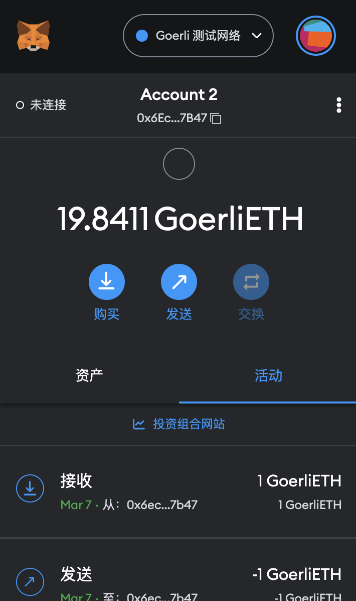
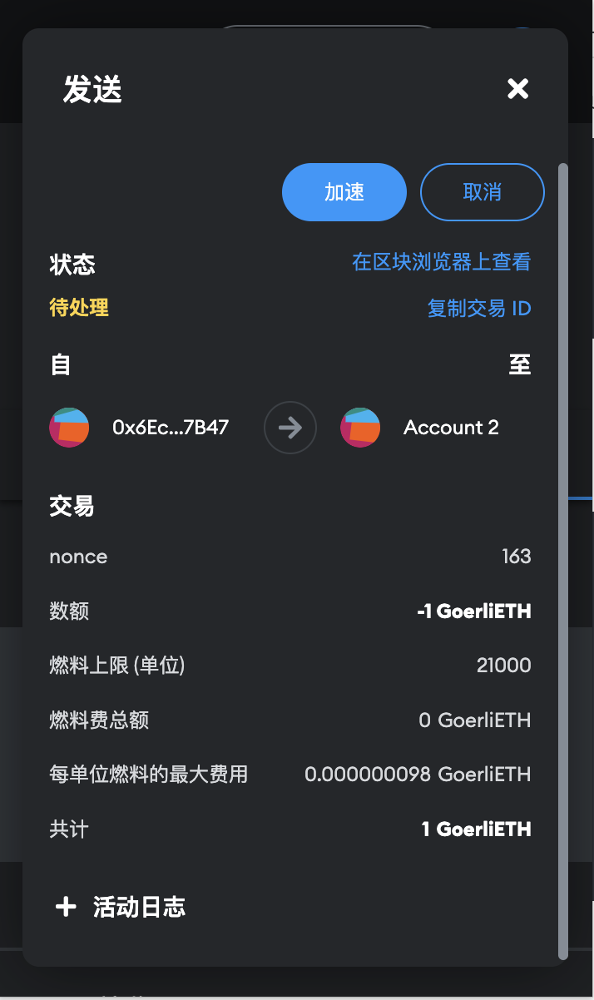
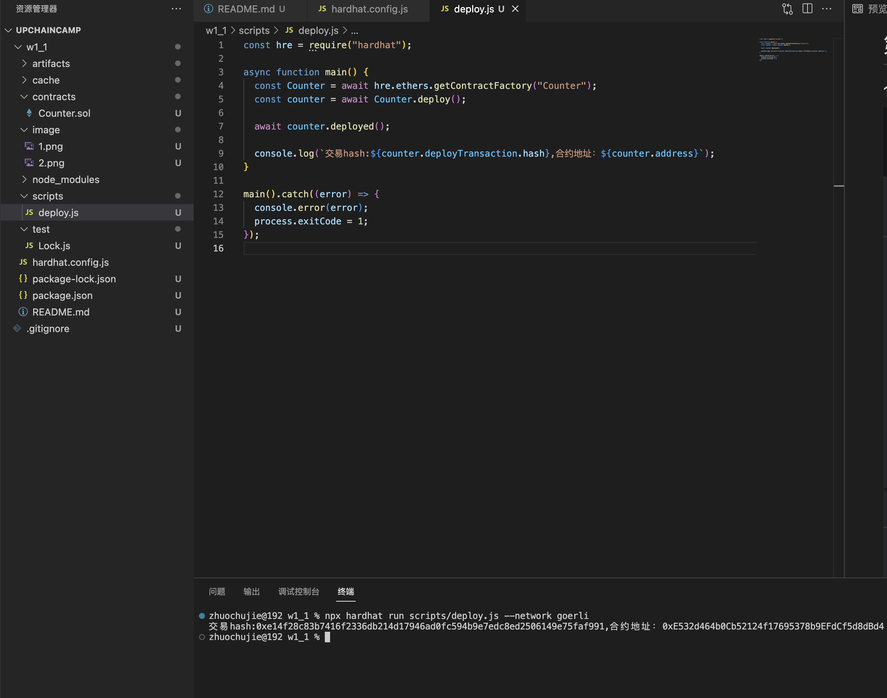
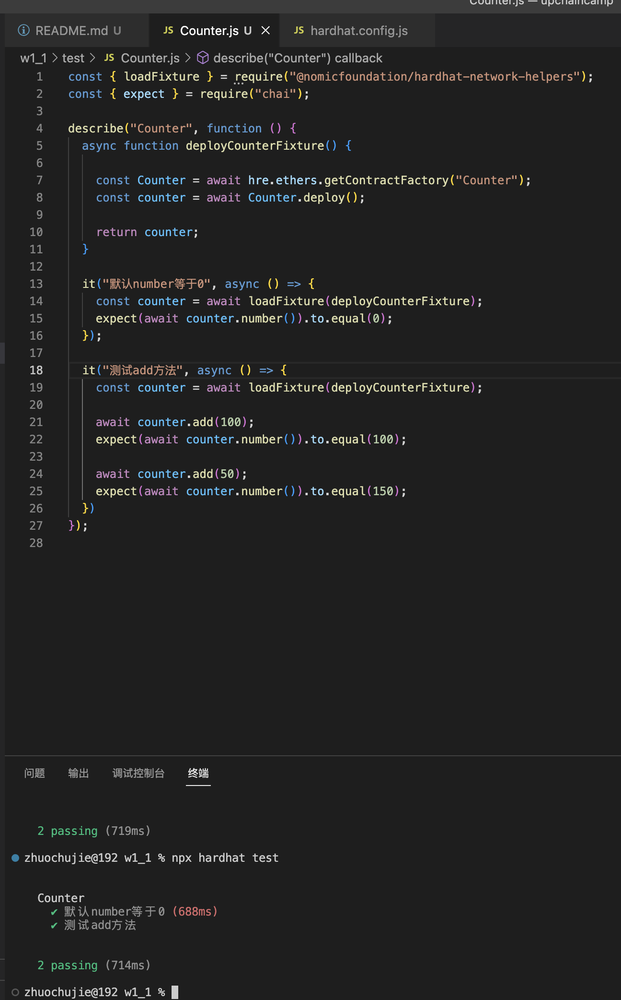

# 第一周第一次作业
## 1.安装Metamask

## 2.转账

hash: 0x4aa9384f3f95a688095fa714fcaaddecbe4a0cc73bf518701bef525990c409ae
## 3.部署合约

交易hash:0xe14f28c83b7416f2336db214d17946ad0fc594b9e7edc8ed2506149e75faf991
合约地址：0xE532d464b0Cb52124f17695378b9EFdCf5d8dBd4
## 4.测试合约
